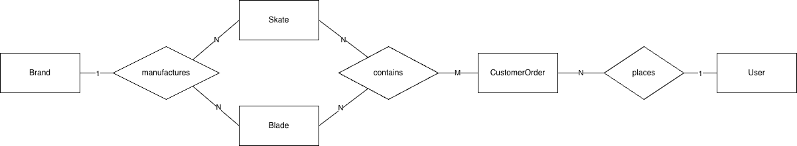
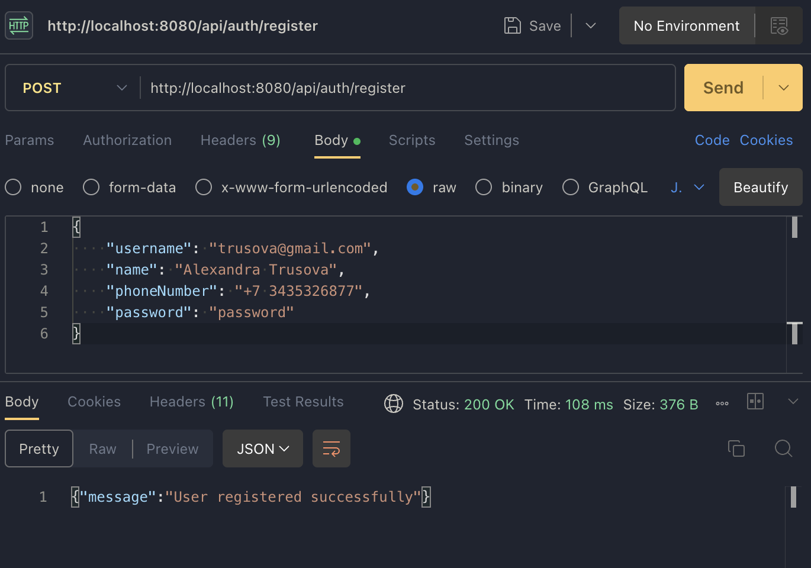

# Final Project: Backend Application with JWT Authentication and Docker

For this project, I decided to implement a backend system for a skate shop to handle orders with.

This ER diagram represents my database's schema, and shows the 1:N and N:N relationships I implemented.


Here is a [YouTube link to the demo video](https://youtu.be/odU3ZQ5hsV8).

## Prerequisities
**Java version:** 17 <br>
**Docker version:** 29.4.2

### Setup instructions:
1. Make sure you have PostgreSQL and Docker Desktop installed on your device.
2. Log into the default PostgreSQL database using `psql -U postgres`
3. Create a new database called `cpsc449final` with `CREATE DATABASE cpsc449final;`.
4. Exit PostgreSQL.
5. Find the file `application.properties.example` in `src/main/resources`. Change its name to `application.properties`, and replace the placeholder values with the correct database information.
6. Create the docker image using the build command below.
7. Use the Docker run command to start up a container. Remember to replace placeholder values in the command with the right values for your database.

Now the backend system should be running, and you can use a tool like Postman to send requests to API endpoints!

## Docker build command
```bash
docker build -t demo-app:1.0 . 
```

## Docker run command
```bash
docker run -d --name demo-app -p 8080:8080 \
  -e SPRING_DATASOURCE_URL=jdbc:postgresql://host.docker.internal:5432/<DATABASE_NAME> \
  -e SPRING_DATASOURCE_USERNAME=<POSTGRES_USERNAME> \
  -e SPRING_DATASOURCE_PASSWORD=<POSTGRES_PASSWORD> \
  demo-app:1.0
```

## Postman example requests

### POST /api/auth/register


### POST /api/brand
Unauthenticated:

Authenticated:
